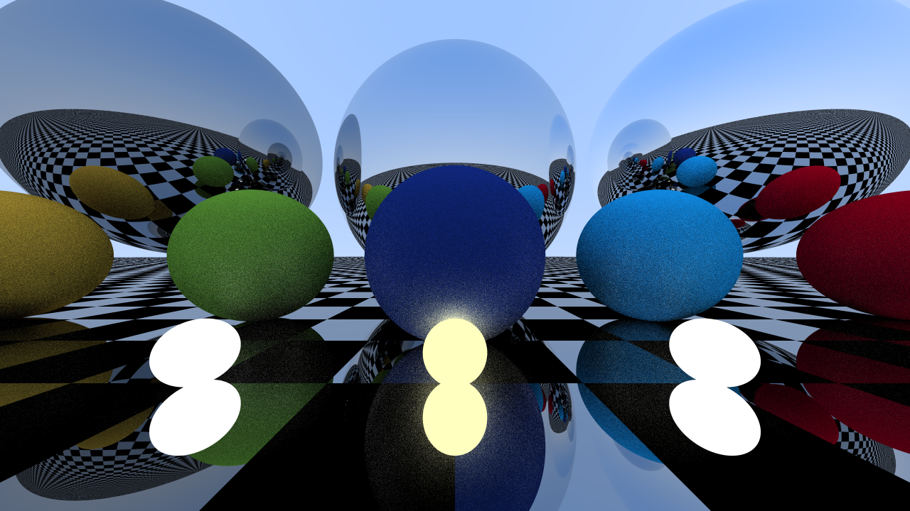

# nprt - numpy ray tracer

## System Requirements
- Needs Python, Numpy, and PIL (Python Image Library)
- Tested with Python 3.9.10, Numpy 1.22.1, and PIL 8.4.0, though older versions of any/all of these probably work

## How to run
First, meet the system requirements. In the terminal, run `python3 rt.py <width> <height> <spp>`, where you supply the width and height of the final image,
and choose the samples per pixel. An appropriate range for spp is at least 1 and at most 10. The output image will be named "render.png".

## Overview of the program
This program is an iterative ray tracer which uses numpy to handle the intensive calculations. While ray tracers tend to be recursive,
this program renders the final image in iterative "passes". In the first pass, rays are projected from the camera into the scene.
In the following passes, we continue to simulate the rays being bounced off of the objects in the scene. If a ray encounters no intersection, 
we don't do any more computation on that ray in the following passes. 

That being said, I do not recommend anyone to write a ray tracer in this form. I wanted to use numpy's capabilities to handle the calculations, 
which in turn led to the iterative structure. This turned out to be annoying to implement, because the standard ray tracing algorithm 
(as seen in Peter Shirley's book) does not translate nicely into iterative code or array/matrix operations. Fortunately, I learned a lot about
ray tracer design through the limitations of this program.

## Details of the program
- Uses supersampling to do anti-aliasing
When supplying the argument for samples per pixel (spp), it actually scales the width and height by spp, so that each pixel gets
spp^2 rays, which are then averaged and downsampled into the final image. Any spp > 10 is probably too much.
- Implements bounding box tests (...not exactly BVH)
The iterative structure of this program does not let it easily integrate with a full BVH. However, when doing ray-object intersection tests,
we test each ray against the object's AABB, and do not continue doing intersection tests on those rays which miss the AABB. In profiling 
tests, this seemed to be a decent (but not outstanding) optimization to the intersection code.
- Support for diffuse, metal, checker-metal, light-emitting, and dielectric materials
After some profiling tests, this ray tracer actually seems to be bottlenecked by the material/color computations, rather than intersection tests. Also, checker-metal is a mixture of checkerboard and metal materials, which I thought looks cool.

## References
Hittable.py and Material.py is essentially Peter Shirley's C++ code which I translated and vectorized into Python and Numpy. On the other hand, everything in rt.py is completely original and done by me.

## Sample render

